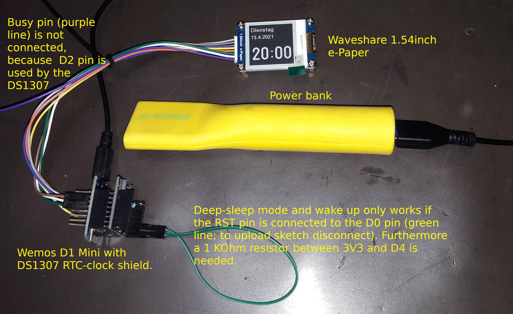
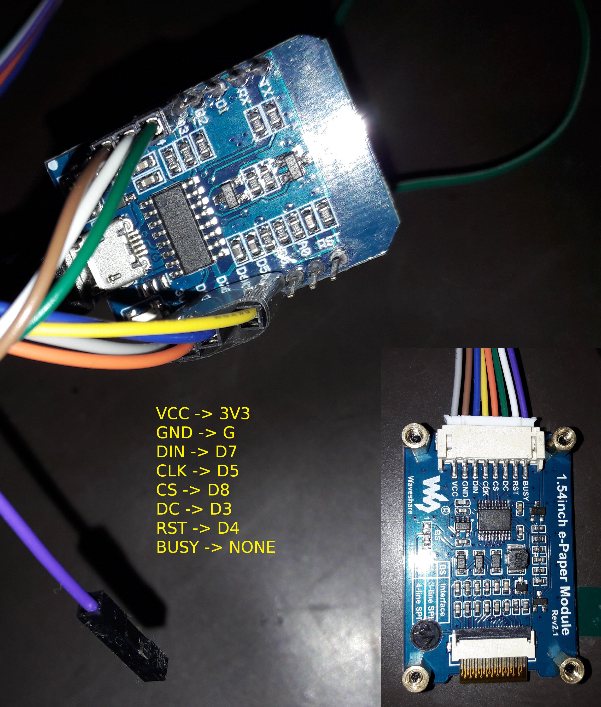

# low_power_ntp_clock
Low power NTP-clock based on Wemos D1 Mini, DS1307 clock shield and a waveshare 1.54inch e-Paper

This project features a low power NPT-clock. The general setup is shown on th picture below:

The wireing for the Wemos-setting is as suggested on https://github.com/ZinggJM/GxEPD2/blob/master/ConnectingHardware.md. Except for the BUSY-line, because the D2 pin is needed for the RTC-shield. Fortunately, the BUSY-line is dispensable.

How does it work?
+ at first boot you are requested to connect to the acces point "ClockCfgAP" (for example with your mobile phone)
+ when the connection is established navigate to 192.168.4.1 and configure the ntp-clock such that it can connect to the NTP-server (I use https://github.com/tzapu/WiFiManager here)
+ then the ntp-clock gets the time from the ntp-server and displays it
+ from then on the ntp-clock displays the time
+ it goes to deep-sleep after each update of the display, i.e for almost one minute every minute)
+ the current time is determined with the RTC-module
+ once every night, the RTC-module gets updated with the NTP-time
